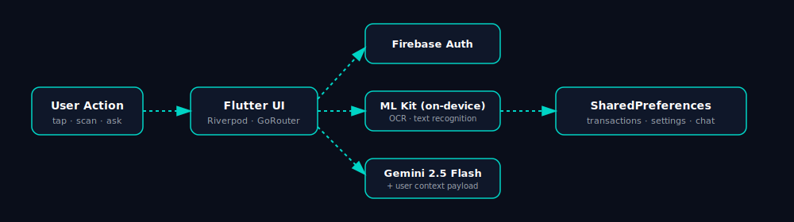

**Your money, finally answering back.**

---

## The Problem It Solves

Indian users juggle bank SMS chaos, scattered receipts, and tax-season panic. Most finance apps either demand bank credentials, drown users in graphs, or pretend a chatbot is "AI." KharchaAI is built for the gap between *spreadsheet discipline* and *zero discipline* — for people who want clarity without surrendering account access.

## What You Actually Get

<table>
<tr>
<td width="33%" valign="top">

### 🧠 An advisor that knows *your* numbers
Not a generic chatbot. Gemini 2.5 Flash sees your real balance, recent transactions, and category splits before answering. Ask *"can I afford this?"* and get an answer grounded in last week's biryani spend, not boilerplate.

</td>
<td width="33%" valign="top">

### 📷 A camera that does the typing
Point at any printed receipt — kirana, Swiggy, fuel, hospital. On-device ML Kit OCR pulls the total in under a second. No upload, no cloud round-trip, no awkward forms.

</td>
<td width="33%" valign="top">

### 📊 A dashboard that updates as you breathe
Add a transaction. Watch the category bars redistribute. Watch the percentages move. Insights aren't a weekly report — they're the next frame after you tap *Save*.

</td>
</tr>
</table>

## Inside the Build

<b>🔐 &nbsp; Authentication that doesn't get in the way</b>

 

Firebase Auth with persistent sessions — open the app three weeks later, you're still in. Glassmorphic login flow with backdrop blur, password visibility toggle, and animated transitions that don't waste your time.

<b>💸 &nbsp; Transactions that respect your time</b>

 

One tap on the floating action button. Pick from 9 curated categories (Food, Transport, Bills, Salary, Freelance, and the rest). Swipe-to-delete in the Activity tab. Running balance recalculates instantly. Everything persists locally via SharedPreferences — no network, no waiting.

<b>🤖 &nbsp; A financial advisor with context</b>

 

Powered by **Gemini 2.5 Flash**. Before each response, the model is fed the user's actual balance, expense categories, income breakdown, and recent transactions. Answers are calibrated to **Indian tax law (FY 2025-26)** — 80C, PPF, ELSS, the lot. Chat history persists across sessions. One-tap suggestion chips for the questions everyone has but nobody types. 30-second timeout with graceful fallback.

<b>📷 &nbsp; OCR that runs on the device</b>

 

Camera or gallery → Google ML Kit text recognition → automatic total detection. Nothing leaves the phone. Works offline. Built for messy real-world receipts, not sample data.

<b>⚙️ &nbsp; Settings that survive reboot</b>

 

Dark / Light mode with full theme propagation. Notification toggles, biometric login, auto-read SMS — all backed by SharedPreferences. Profile pulls live from Firebase, not a local cache that drifts.

<b>🎨 &nbsp; A design that earns the dark mode label</b>

 

`#00D4C5` teal accent on glassmorphic dark surfaces. Poppins for display, Inter for body — paired the way they're meant to be. Staggered fade-ins via `flutter_animate`. Time-aware greetings (Good Morning / Afternoon / Evening). Bottom navigation with three tabs that actually need to be tabs.

## Engineering Stack

| Layer | Choice | Why |
|---|---|---|
| **Framework** | Flutter | One codebase, native performance |
| **State** | Riverpod | Compile-safe, testable, no `BuildContext` games |
| **Routing** | GoRouter (ShellRoute) | Bottom nav that doesn't fight back navigation |
| **Auth** | Firebase Auth | Persistent sessions out of the box |
| **AI** | Gemini 2.5 Flash | Latency low enough for chat, context window large enough for real data |
| **OCR** | Google ML Kit | On-device, no network, no privacy concession |
| **Storage** | SharedPreferences | Zero ceremony for local-first state |
| **Config** | flutter_dotenv | Keys in `.env`, not in source |
| **Build** | Java 17 + AGP Kotlin DSL | Modern toolchain, suppressed warning noise |

## Architecture, in One Glance

Auth stays in Firebase. AI runs in the cloud. OCR stays on-device. Everything else lives locally — which is why the app feels instant and works on a flaky train.

## Privacy Posture

- **No bank credentials. Ever.** This isn't an aggregator.
- **OCR is on-device.** Your receipts don't leave the phone.
- **API keys via `.env`**, gitignored, never compiled into source.
- **Only the AI advisor touches the network** for inference — and the prompt is the data, not your account.

## Status

| Module | State |
|---|---|
| Firebase authentication | Shipped |
| Transaction CRUD with persistence | Shipped |
| Gemini-powered advisor with live user context | Shipped |
| Insights dashboard with real-time recalculation | Shipped |
| Receipt scanner via on-device OCR | Shipped |
| Persistent settings (theme, notifications, biometrics) | Shipped |
| Light / Dark theme switching | Shipped |
| Build pipeline (Java 17 + AGP Kotlin DSL) | Hardened |

## Built For

The Indian millennial and Gen-Z user who wants to know *where the money went* without handing over net banking credentials, who has a folder of receipts they'll "deal with later," and who has googled *"how to save tax"* at least three times this year.

Crafted in Flutter · Powered by Gemini · Built in India

